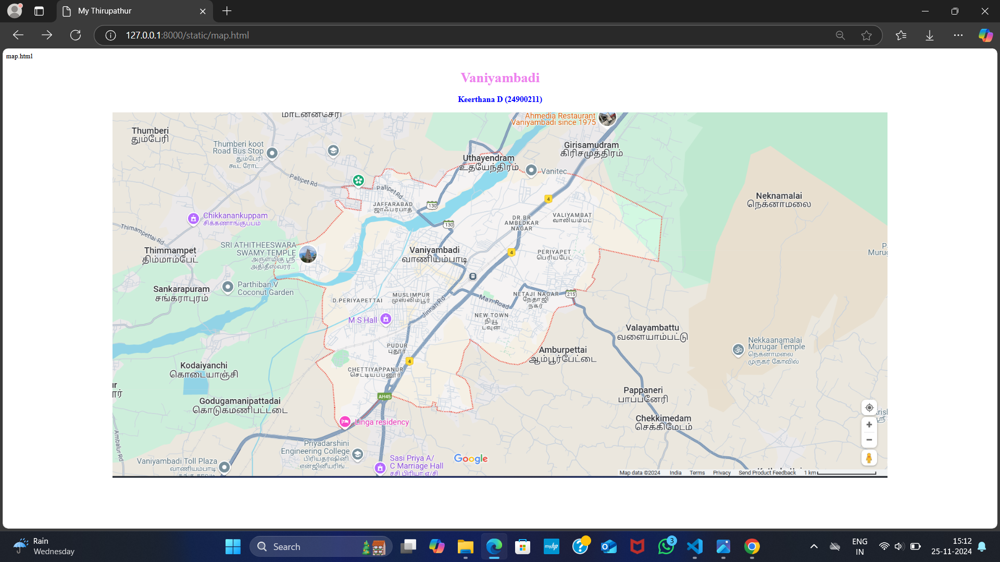
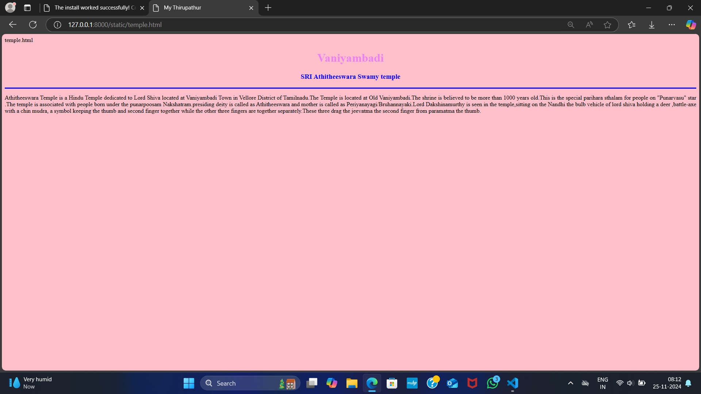
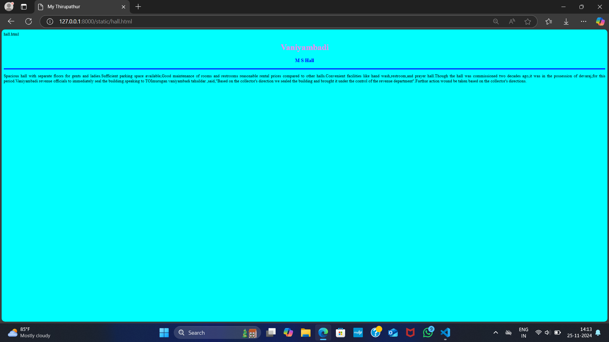
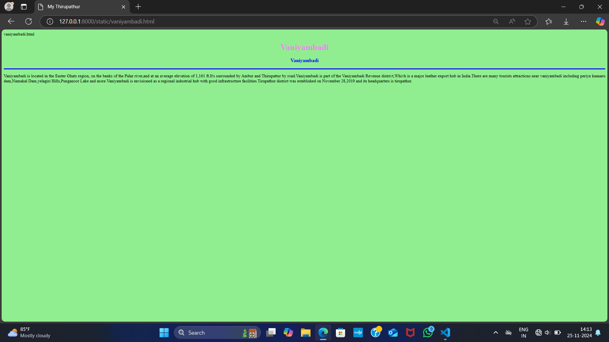
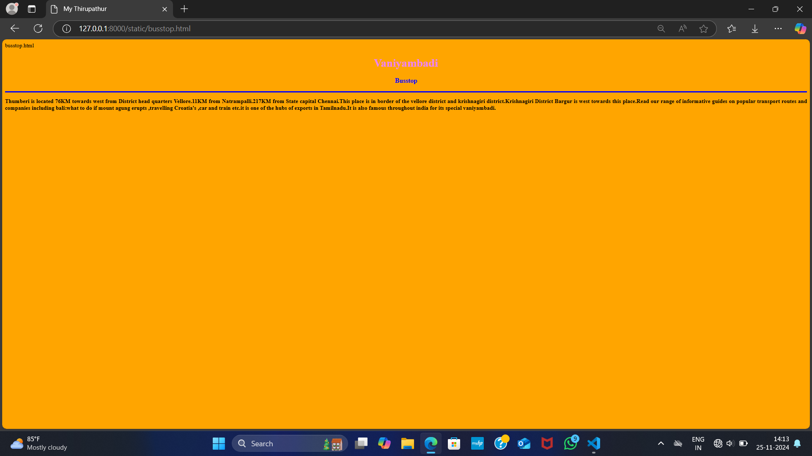
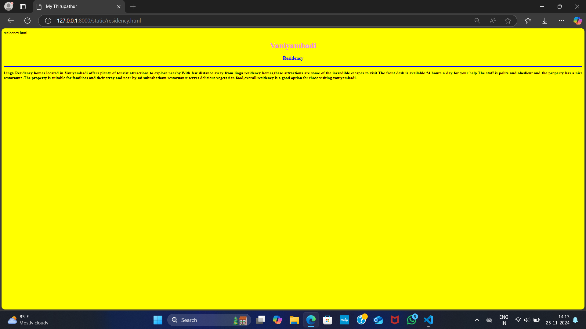

# Ex04 Places Around Me
## Date: 25/11/2024

## AIM
To develop a website to display details about the places around my house.

## DESIGN STEPS

### STEP 1
Create a Django admin interface.

### STEP 2
Download your city map from Google.

### STEP 3
Using ```<map>``` tag name the map.

### STEP 4
Create clickable regions in the image using ```<area>``` tag.

### STEP 5
Write HTML programs for all the regions identified.

### STEP 6
Execute the programs and publish them.

## CODE
```
map.html
<html>
<head>
<title>My Thirupathur</title>
</head>
<body>
<h1 align="center">
<font color="violet"><b>Vaniyambadi</b></font>    
</h1>
<h3 align="center">
<font color="blue"><b>Keerthana D (24900211)</b></font>    
</h3>
<center>


<map name="MyThirupathur">
   

   
    <area target="" alt="temple" title="temple" href="temple.html" coords="170,232,491,380" shape="rect">
    <area target="" alt="hall" title="hall" href="hall.html" coords="568,483,40" shape="circle">
    <area target="" alt="vaniyambadi" title="vaniyambadi" href="vaniyambadi.html" coords="605,244,895,379" shape="rect">
    <area target="" alt="busstop" title="busstop" href="busstop.html" coords="306,88,123" shape="circle">
    <area target="" alt="residency" title="residency" href="residency.html" coords="515,687,698,731" shape="rect">

</map>    
</center>
</body>
</html> 

busstop.html

<html>
<head>
<title>My Thirupathur</title>
</head>
<body bgcolor="orange">
<h1 align="center">
<font color="violet"><b>Vaniyambadi</b></font>    
</h1>
<h3 align="center">
<font color="blue"><b>Busstop</b></font>    
</h3>
<hr size="3" color="blue">
<p align="justify">
<front face="Georgia" size="5">
<b>
Thumberi is located 76KM towards west from District head quarters Vellore.11KM from Natrampalli.217KM from State capital Chennai.This place is in border of the vellore district and krishnagiri district.Krishnagiri District Bargur is west towards this place.Read our range of informative guides on popular transport routes and companies including bali:what to do if mount agung erupts ,travelling Croatia's ,car and train etc.it is one of the hubs of exports in Tamilnadu.It is also famous throughout india for its special vaniyambadi. 
</b>
</front>
<p>
</body>
</html>

hall.html

<html>
<head>
<title>My Thirupathur</title>
</head>
<body bgcolor="cyan">
<h1 align="center">
<font color="violet"><b>Vaniyambadi</b></font>    
</h1>
<h3 align="center">
<font color="blue"><b>M S Hall</b></font>    
</h3>
<hr size="3" color="blue">
<p align="justify">
<front face="Georgia" size="5">
Spacious hall with separate floors for gents and ladies.Sufficient parking space available,Good maintenance of rooms and restrooms reasonable rental prices compared to other halls.Convenient facilities like hand wash,restroom,and prayer hall.Though the hall was commissioned two decades ago,it was in the possession of devaraj,for this period.Vaniyambadi revenue officials to immediately seal the buildimg.speaking to TOImurugan vaniyambadi tahsildar ,said,"Based on the collector's direction we sealed the building and brought it under the control of the revenue department".Furthur action wound be taken based on the collector's directions.
</front>
<p>
</body>
</html>

residency.html

<html>
<head>
<title>My Thirupathur</title>
</head>
<body bgcolor="yellow">
<h1 align="center">
<font color="violet"><b>Vaniyambadi</b></font>    
</h1>
<h3 align="center">
<font color="blue"><b>Residency</b></font>    
</h3>
<hr size="3" color="blue">
<p align="justify">
<front face="Georgia" size="5">
<b>
Linga Residency homes located in Vaniyambadi offers plenty of tourist attractions to explore nearby.With few distance away from linga residency homes,these attractions are some of the incredible escapes to visit.The front desk is available 24 hours a day for your help.The staff is polite and obedient and the property has a nice restaraunt .The property is suitable for familioes and their stray and near by sai subrabatham restaruanrt serves delicious vegetarian food,overall residency is a good option for those visiting vaniyambadi.
</b>
</front>
<p>
</body>
</html>

temple.html
<html>
<head>
<title>My Thirupathur</title>
</head>
<body bgcolor="pink">
<h1 align="center">
<font color="violet"><b>Vaniyambadi</b></font>    
</h1>
<h3 align="center">
<font color="blue"><b>SRI Athitheeswara Swamy temple</b></font>    
</h3>
<hr size="3" color="blue">
<p align="justify">
<front face="Georgia" size="5">
Athitheeswara Temple is a Hindu Temple dedicated to Lord Shiva located at Vaniyambadi Town in Vellore District of Tamilnadu.The Temple is located at Old Vaniyambadi.The shrine is believed to be more than 1000 years old.This is the special parihara sthalam for people on "Punarvasu" star .The temple is associated with people born under the punarpoosam Nakshatram.presiding deity is called as Athitheeswara and mother is called as Periyanayagi/Bruhannayaki.Lord Dakshinamurthy is seen in the temple,sitting on the Nandhi the bulb vehicle of lord shiva holding a deer ,battle-axe with a chin mudra, a symbol keeping the thumb and second finger together while the other three fingers are together separately.These three drag the jeevatma the second finger from paramatma the thumb.
</front>
<p>
</body>
</html>

vaniyambadi.html

<html>

<head>
<title>My Thirupathur</title>
</head>
<body bgcolor="lightgreen">
<h1 align="center">
<font color="violet"><b>Vaniyambadi</b></font>    
</h1>
<h3 align="center">
<font color="blue"><b>Vaniyambadi</b></font>    
</h3>
<hr size="3" color="blue">
<p align="justify">
<front face="Georgia" size="5">
Vaniyambadi is located in the Easter Ghats region, on the banks of the Palar river,and at an average elevation of 1,161 ft.It's surrounded by Ambur and Thirupattur by road.Vaniyambadi is part of the Vaniyambadi Revenue distrivt,Whivh is a major leather export hub in India.There are many tourists attractions near vaniyambadi including periya kaanaru dam,Namakal Dam,yelagiri Hills,Punganoor Lake and more.Vaniyambadi is envisioned as a regional industrial hub with good infrastructure facilities.Tirupathur district was established on November 28,2019 and its headquarters is tirupathur. 
</front>
<p>
</body>
</html>

```

## OUTPUT













## RESULT
The program for implementing image maps using HTML is executed successfully.
